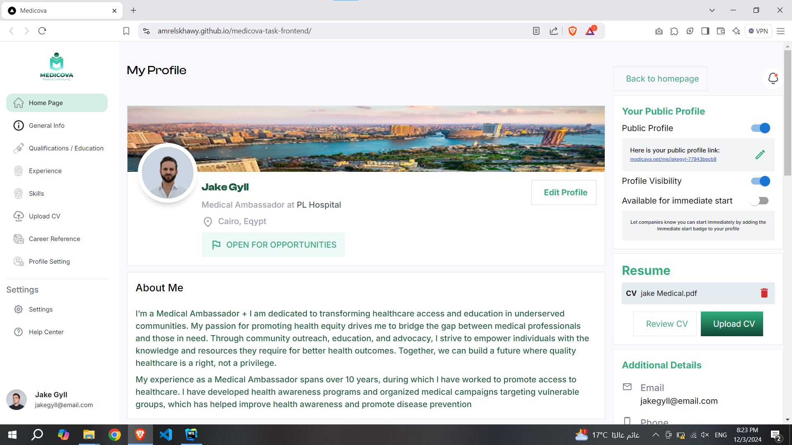
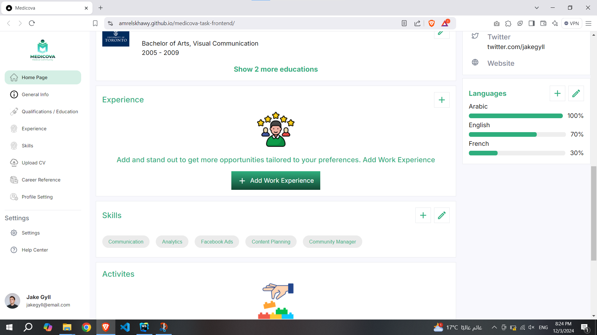
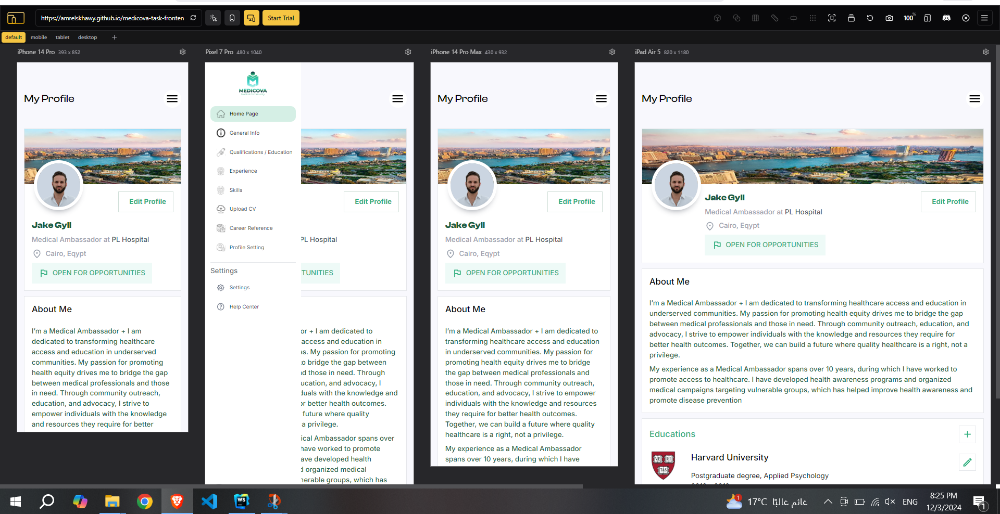

# Next.js Full-Page Responsive Web Application

This project is a web page built using **Next.js**, **TypeScript**, **Material UI**, and **Tailwind CSS**. The design is fully responsive and follows a full-page layout to ensure compatibility across different devices. The goal of this project is to demonstrate best practices and the use of common standards in web development.

### Live Demo : [Click here](https://amrelskhawy.github.io/medicova-task-frontend/)


## Table of Contents
- [Technologies Used](#technologies-used)
- [Getting Started](#getting-started)
- [Prerequisites](#prerequisites)
- [Installation](#installation)
- [Screenshots](#screenshots)

## Technologies Used

- **Next.js** (Version 14.2.5) for building the React application.
- **TypeScript** for type safety and better developer experience.
- **Material UI** (Version 5.16.7) for UI components.
- **Tailwind CSS** (Version 3.4.15) for utility-first CSS framework.
- **React** for building components.

## Getting Started

Follow the instructions below to set up and run this project on your local machine.

### Prerequisites

Before you begin, ensure that you have the following software installed:

- **Node.js** (Version 14.x or above) – [Download Node.js](https://nodejs.org/)
- **npm** or **Yarn** – Package managers for JavaScript

To verify that Node.js and npm are installed, run the following commands in your terminal:

```bash
# to install dependencies
npm install
```
### to run the app after installing the dependencies
```bash
# to run the application
npm run dev
```


## Screenshots from live demo

### 1. Desktop Version



### 2. Mobile and tablets Version


